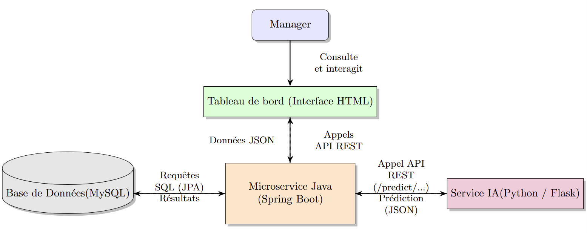

# Microservice de Détection d'Anomalies RH avec IA

Ce projet est un écosystème de microservices intelligent développé avec **Spring Boot (Java)** et **Flask (Python)** dans le cadre d'un stage chez COMPUTIME. Son objectif est de détecter, d'analyser et de proposer des solutions pour diverses anomalies de pointage du personnel, en s'appuyant sur des modèles de Machine Learning.

L'ensemble de l'application est **conteneurisé avec Docker** et orchestré via **Docker Compose**, permettant un lancement complet et reproductible avec une seule commande.

---

##  Fonctionnalités Principales

Le service applique une logique métier avancée pour fournir une détection d'anomalies contextuelle et intelligente :

*    **Analyse Contextuelle Intelligente** : Avant de générer une anomalie pour une absence, le système vérifie systématiquement si la journée est couverte par une **justification valide** (congé, absence autorisée, récupération, exception de planning). Une anomalie n'est créée qu'en dernier recours.

*   **Omission de Pointage** : Détecte les journées avec un nombre impair de pointages et fait appel à l'IA pour proposer une heure de correction pertinente.

*   **Retard à l'arrivée / Sortie Anticipée** : Identifie les pointages ne respectant pas les plages horaires prévues (en tenant compte des tolérances) et demande à l'IA une suggestion d'action.

*   **Heures Supplémentaires non autorisées** : Calcule le temps de travail dépassant la durée théorique et utilise l'IA pour suggérer une décision (Accepter/Rejeter) basée sur le contexte.

*   **Travail un Jour de Repos / Férié** : Identifie les pointages effectués sur des jours non travaillés selon le planning de l'employé ou le calendrier des jours fériés.

*   **Absence Injustifiée** : Détecte les jours où un employé aurait dû travailler mais n'a aucun pointage (et après avoir vérifié qu'aucune justification n'existe). L'IA est ensuite consultée pour évaluer le risque.

*    **Prédiction d'Absences Futures** : Utilise les données historiques pour prédire la probabilité d'absence d'un employé dans les jours à venir, aidant ainsi à la planification proactive.

---

##  Architecture Technique

L'écosystème est composé de deux services conteneurisés conçus pour fonctionner ensemble :

1.  **Service de Détection (`java-app`)** :
    *   Développé en **Java / Spring Boot**.
    *   Responsable de la logique métier, de la communication avec la base de données (MySQL), et de l'exposition des API REST pour la gestion des anomalies.
    *   Orchestre les appels vers le service d'IA pour enrichir les anomalies.

2.  **Service d'IA (`python-ai`)** :
    *   Développé en **Python / Flask**.
    *   Responsable de servir les modèles de Machine Learning (entraînés avec `scikit-learn` et `lightgbm`).
    *   Expose des endpoints REST (ex: `/predict/retard`) pour fournir des prédictions et des suggestions intelligentes.

Les deux services sont lancés et mis en réseau automatiquement par **Docker Compose**.


---

##  Prérequis

Pour lancer ce projet, vous n'avez besoin que des outils suivants installés sur votre machine :

*   [**Git**](https://git-scm.com/)
*   [**Docker Desktop**](https://www.docker.com/products/docker-desktop/)
*   [**MySQL Server**](https://dev.mysql.com/downloads/mysql/) (ou tout autre serveur MySQL accessible)

*Note : Il n'est PAS nécessaire d'installer Java, Maven ou Python sur la machine hôte. Docker s'occupe de tout.*

---

## Configuration Cruciale
Avant de lancer le projet, vous devez configurer la connexion à la base de données.
À la racine du projet, trouvez le fichier **src/main/resources/application-docker.properties**.
Modifiez les lignes suivantes avec vos informations de connexion MySQL :

 * Remplacez "mysql-server" par "host.docker.internal" si votre DB tourne sur votre machine hôte Windows/Mac.
  spring.datasource.url=jdbc:mysql://mysql-server:3306/sicda_easytime
  spring.datasource.username=root
 * METTEZ VOTRE MOT DE PASSE MYSQL ICI
  spring.datasource.password=votre_mot_de_passe_ici


---
##  Guide de Lancement Rapide

Lancer l'intégralité de l'écosystème se fait en 3 étapes simples.

### 1. Base de Données

1.  Assurez-vous que votre serveur MySQL est démarré.
2.  Créez une base de données (schema) nommée `sicda_easytime`.
3.  Importez les scripts SQL fournis pour créer les tables et insérer les données.

### 2. Récupération du Projet

Clonez ce dépôt sur votre machine locale :
```bash
git clone [URL_DE_VOTRE_DEPOT_GITHUB]
cd anomaly-detector
```

### 3. Lancement avec Docker Compose

Depuis la racine du projet, lancez la commande suivante. **C'est la seule commande dont vous avez besoin.**

```bash
docker-compose up --build
```

Cette commande va automatiquement :
1.  Construire l'image Docker pour le service Java.
2.  Construire l'image Docker pour le service Python.
3.  Démarrer les deux conteneurs et les connecter ensemble sur un réseau privé.

Attendez que les logs se stabilisent et que vous voyiez les messages de démarrage des serveurs Java (Tomcat) et Python (Flask). L'application est maintenant prête !

Pour tout arrêter proprement, ouvrez un autre terminal et lancez :
```bash
docker-compose down
```

---

## Dépendance des Données d'Entraînement

**Information importante** : Les modèles de Machine Learning (fichiers .pkl) inclus dans ce projet ont été entraînés sur une base de données spécifique.
Les prédictions et suggestions de l'IA sont donc optimisées pour la structure et les tendances de ces données d'origine.
Pour obtenir des résultats pertinents sur une **nouvelle base de données**, il est **impératif de ré-entraîner les modèles** en utilisant les notebooks Jupyter fournis dans le projet, puis de remplacer les anciens fichiers .pkl par les nouveaux.

---

##  Documentation de l'API (Exemples)

Une fois l'application lancée, vous pouvez interagir avec elle via un client API comme Postman ou via l'interface de démonstration.
| Objectif                                      | Méthode | URL                                                      |
| --------------------------------------------- | ------- | -------------------------------------------------------- |
| **Lancer une détection manuelle pour un jour**    | `POST`  | `http://localhost:8080/api/anomalies/detecter/{date}`      |
| **Consulter les anomalies en attente pour un manager**          | `GET`   | `http://localhost:8080/api/anomalies/en-attente`           |
| **Valider une anomalie (ex: ID 7)**             | `POST`  | `http://localhost:8080/api/anomalies/7/valider`            |
| **Prédire les absences pour les 15 prochains jours** | `GET`   | `http://localhost:8080/api/predictions/absences/15`        |
**Interface de démonstration** :
Tableau de bord Manager : http://localhost:8080/dashboard/manager/{id_manager}

*(Remplacez `{date}` par une date au format `YYYY-MM-DD`)*.